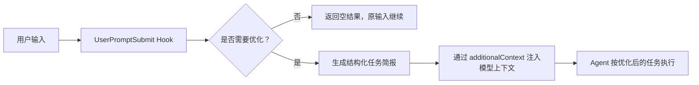

[中文](./README.md) | [English](./README_EN.md)

<div align="center">

# HookPrompt

**把随口说出的需求，自动整理成可执行、可验收的专业提示词**


</div>

## 简介

HookPrompt 是一个面向 Claude Code、Codex 等 Agent 工具的 `UserPromptSubmit` Hook。它会在用户输入进入模型前，把自然语言请求整理成更适合执行的结构化任务简报。

它重点解决三类问题：

- 用户只说了模糊需求，Agent 不知道真实目标和验收标准。
- 用户反馈很短，例如“这个不行”“报错了”“帮我看看”，但其实需要诊断或修复。
- 任务需要清晰边界、成功标准和验证计划，否则容易变成“看起来执行了，但没有真的完成”。

HookPrompt 默认要求模型在首条回复中展示三段式结果：

```text
原始输入 -> 优化后的理解 -> 优化后的完整提示词
```

优化后的完整提示词会使用 role-first、outcome-contract、tagged structure、success criteria 和 verification plan，让后续执行更清楚、更可控。

## 工作方式



HookPrompt 不会替代模型执行任务。它做的是在任务开始前把意图、边界、输出格式和验证标准说清楚。

## 核心能力

| 能力 | 说明 |
|---|---|
| 结构化优化 | 将普通输入整理成 Context / Task / Format 摘要和完整执行提示词 |
| 结果契约 | 明确 goal、scope、success criteria、verification plan 和 stop conditions |
| 智能过滤 | 跳过纯确认、普通内置命令等无需优化的输入 |
| 短诊断触发 | 对“这个不行”“报错了”“帮我看看”等短输入仍会触发优化 |
| Prompt 级治理入口 | `/meta-theory ...` 等治理类入口会继续进入优化流程 |
| Claude Code 支持 | 提供 `.claude/hooks/user-prompt-submit.js` 和配置示例 |
| Codex 支持 | 提供 `.codex/hooks/user-prompt-submit.js` 和 `hooks.json` |
| 跨平台 | Node.js 版本可在 Windows、macOS、Linux 使用；Bash 版本适合 macOS/Linux |

## 输入过滤规则

| 输入类型 | 是否优化 |
|---|---|
| Claude Code 内置命令，例如 `/clear`、`/help`、`/commit` | 不优化 |
| Prompt 级治理入口，例如 `/meta-theory ...` | 优化 |
| 短诊断 / 修复意图，例如“这个不行”“报错了”“帮我看看” | 优化 |
| 无任务含义的短输入 | 不优化 |
| 简单回复，例如“好的”“继续”“ok” | 不优化 |
| 正常需求描述 | 优化 |

## 快速开始

### 1. 本项目内验证

在项目根目录运行：

```bash
node test-hook.js
```

测试脚本会验证短输入过滤、诊断触发、正常需求优化和 Codex JSON 输入提取。

### 2. 复制到 Claude Code 项目

把 `.claude` 目录复制到目标项目根目录：

```bash
cp -r .claude /your/project/root/
```

Windows PowerShell：

```powershell
Copy-Item -Recurse .claude D:\YourProject\
```

目标项目中的 `.claude/settings.json` 应使用 `UserPromptSubmit`：

```json
{
  "hooks": {
    "UserPromptSubmit": [
      {
        "hooks": [
          {
            "type": "command",
            "command": "node",
            "args": [".claude/hooks/user-prompt-submit.js"]
          }
        ]
      }
    ]
  }
}
```

### 3. 复制到 Codex 项目

把 `.codex` 目录复制到目标项目根目录：

```bash
cp -r .codex /your/project/root/
```

Codex 入口会从标准输入 JSON 中提取 `prompt` 字段，并通过 `hookSpecificOutput.additionalContext` 返回模型可见上下文。

## 全局安装

### Claude Code

Windows PowerShell：

```powershell
New-Item -ItemType Directory -Force "$env:USERPROFILE\.claude\hooks" | Out-Null
Copy-Item -Force .claude\hooks\user-prompt-submit.js "$env:USERPROFILE\.claude\hooks\user-prompt-submit.js"
Copy-Item -Force .claude\prompt-optimizer-meta.md "$env:USERPROFILE\.claude\prompt-optimizer-meta.md"
```

macOS / Linux：

```bash
mkdir -p ~/.claude/hooks
cp .claude/hooks/user-prompt-submit.js ~/.claude/hooks/
cp .claude/hooks/user-prompt-submit.sh ~/.claude/hooks/
cp .claude/prompt-optimizer-meta.md ~/.claude/
chmod +x ~/.claude/hooks/*.sh
```

然后在 `~/.claude/settings.json` 中配置绝对路径更稳：

```json
{
  "hooks": {
    "UserPromptSubmit": [
      {
        "hooks": [
          {
            "type": "command",
            "command": "node",
            "args": ["C:/Users/your-name/.claude/hooks/user-prompt-submit.js"]
          }
        ]
      }
    ]
  }
}
```

### Codex

把 `.codex/hooks/user-prompt-submit.js` 复制到你的 Codex hook 目录，并在对应 `hooks.json` 中配置 `UserPromptSubmit`。项目级使用时，直接保留本仓库的 `.codex/hooks.json` 即可。

## 配置选项

### 完整体验与紧凑模式

默认模式会注入完整 meta 模板，保证用户可见回复包含完整三段式：

- 原始输入
- 优化后的理解
- 优化后的完整提示词

只有在明确需要更短后台上下文时，才设置：

```bash
HOOKPROMPT_COMPACT_CONTEXT=1
```

### 自定义优化规则

编辑 `.claude/prompt-optimizer-meta.md` 可以调整：

- 任务角色判断方式
- 目标、范围和验收标准字段
- 输出格式
- 高风险操作的暂停条件
- 示例和自查清单

## 文件结构

```text
HookPrompt/
├── .claude/
│   ├── hooks/
│   │   ├── user-prompt-submit.js
│   │   └── user-prompt-submit.sh
│   ├── prompt-optimizer-meta.md
│   ├── settings.json
│   ├── settings.json.example-windows
│   └── settings.json.example-unix
├── .codex/
│   ├── hooks/
│   │   └── user-prompt-submit.js
│   └── hooks.json
├── docs/
│   └── images/
│       ├── contact-qr.png
│       ├── wechat-pay.jpg
│       └── alipay.jpg
├── CHANGELOG.md
├── LICENSE
├── README.md
├── README_EN.md
└── test-hook.js
```

## 测试

运行：

```bash
node test-hook.js
```

建议在修改 Hook 逻辑、过滤规则、Codex 适配或提示词模板后都运行一次。

测试通过只代表本地脚本行为符合预期；真实工具内是否展示优化结果，还需要在 Claude Code 或 Codex 会话中实际触发一次确认。

## 故障排查

### Hook 没有执行

优先检查：

1. `settings.json` 的键名必须是 `UserPromptSubmit`，不是 `user-prompt-submit`。
2. `hooks` 值必须是数组结构。
3. 命令里必须包含 `type: "command"`。
4. 本机必须能运行 `node -v`。
5. 修改配置后需要重启 Claude Code 或重新打开相关会话。

### Windows 找不到脚本

Windows 下建议使用绝对路径，并使用 `/` 或转义后的 `\\`：

```json
"args": ["C:/Users/your-name/.claude/hooks/user-prompt-submit.js"]
```

### 没有显示优化过程

可能原因：

- 输入被识别为纯确认或普通命令。
- Hook 返回了空对象 `{}`，表示主动跳过。
- 工具侧没有把 `additionalContext` 展示为可见回复。

可以用更明确的任务输入测试，例如：

```text
帮我做一个登录功能，要求有测试和错误处理
```

### 查看日志

Windows：

```powershell
Get-Content "$env:TEMP\hook-prompt-optimizer.log"
```

macOS / Linux：

```bash
cat /tmp/hook-prompt-optimizer.log
```

## 变更记录

版本历史已迁移到 [CHANGELOG.md](./CHANGELOG.md)。

## 联系方式


GitHub <a href="https://github.com/KimYx0207">KimYx0207</a> |
X <a href="https://x.com/KimYx0207">@KimYx0207</a> |
官网 <a href="https://www.aiking.dev/">aiking.dev</a> |
微信公众号：<strong>老金带你玩AI</strong>

飞书知识库：
<a href="https://my.feishu.cn/wiki/OhQ8wqntFihcI1kWVDlcNdpznFf">长期更新入口</a>

### 请老金喝杯咖啡

如果 HookPrompt 对你有帮助，欢迎请我喝杯咖啡，算是对持续维护的支持。

<table align="center">
<tr><th>微信支付</th><th>支付宝</th></tr>
<tr>
<td align="center"></td>
<td align="center"></td>
</tr>
</table>

## 贡献

欢迎提交 Issue 或 PR。修改时请优先保持三条边界：

1. 不把“提示词写长”当成质量目标。
2. 不把命令通过当成用户目标完成。
3. 不把联系方式、二维码、付款码写成外部不可控链接。

## License

MIT License. See [LICENSE](./LICENSE).
