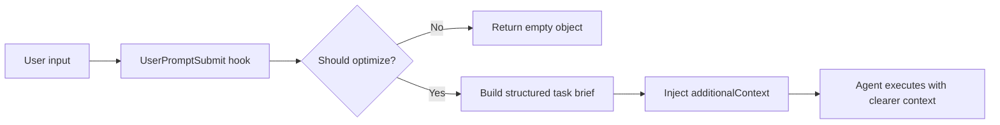

[English](./README_EN.md) | [中文](./README.md)

<div align="center">

# HookPrompt

**Turn casual requests into executable, verifiable prompts before an Agent starts work**


</div>

## Overview

HookPrompt is a `UserPromptSubmit` hook for Claude Code, Codex, and similar Agent tools. It rewrites natural-language user input into a structured task brief before the model receives it.

It helps with three common failure modes:

- The user gives a fuzzy request, and the Agent does not know the real goal or acceptance criteria.
- The user gives short feedback such as "this does not work", "error", or "please check", but the actual intent is diagnosis or repair.
- The task needs scope, success criteria, and a verification plan before execution, otherwise the Agent may appear busy without proving the user goal is done.

By default, HookPrompt asks the model to start its first visible reply with a three-part structure:

```text
Original input -> Optimized understanding -> Optimized full prompt
```

The optimized prompt uses role-first framing, outcome contracts, tagged structure, success criteria, and a verification plan.

## How It Works



HookPrompt does not execute the task itself. It clarifies intent, boundaries, output shape, and proof requirements before the Agent starts.

## Core Features

| Feature | Description |
|---|---|
| Structured optimization | Turns user input into a Context / Task / Format summary and a complete execution prompt |
| Outcome contract | Adds goal, scope, success criteria, verification plan, and stop conditions |
| Smart filtering | Skips confirmations and ordinary built-in commands |
| Short diagnostic trigger | Still optimizes short repair-oriented input |
| Prompt-level governance entry | Keeps `/meta-theory ...` in the optimization path |
| Claude Code support | Provides `.claude/hooks/user-prompt-submit.js` and config examples |
| Codex support | Provides `.codex/hooks/user-prompt-submit.js` and `hooks.json` |
| Cross-platform | Node.js works on Windows, macOS, and Linux; Bash is available for macOS/Linux |

## Filtering Rules

| Input type | Optimized? |
|---|---|
| Claude Code built-in commands such as `/clear`, `/help`, `/commit` | No |
| Prompt-level governance entries such as `/meta-theory ...` | Yes |
| Short diagnostic or repair intent such as "this does not work", "error", "please check" | Yes |
| Short input without task intent | No |
| Simple confirmations such as "ok" or "continue" | No |
| Normal requirement descriptions | Yes |

## Quick Start

### 1. Verify in This Project

Run from the repository root:

```bash
node test-hook.js
```

The test script checks short-input filtering, diagnostic triggering, normal request optimization, and Codex JSON input extraction.

### 2. Copy to a Claude Code Project

Copy `.claude` into the target project root:

```bash
cp -r .claude /your/project/root/
```

Windows PowerShell:

```powershell
Copy-Item -Recurse .claude D:\YourProject\
```

The target `.claude/settings.json` should use `UserPromptSubmit`:

```json
{
  "hooks": {
    "UserPromptSubmit": [
      {
        "hooks": [
          {
            "type": "command",
            "command": "node",
            "args": [".claude/hooks/user-prompt-submit.js"]
          }
        ]
      }
    ]
  }
}
```

### 3. Copy to a Codex Project

Copy `.codex` into the target project root:

```bash
cp -r .codex /your/project/root/
```

The Codex adapter extracts the `prompt` field from stdin JSON and returns model-visible context through `hookSpecificOutput.additionalContext`.

## Global Installation

### Claude Code

Windows PowerShell:

```powershell
New-Item -ItemType Directory -Force "$env:USERPROFILE\.claude\hooks" | Out-Null
Copy-Item -Force .claude\hooks\user-prompt-submit.js "$env:USERPROFILE\.claude\hooks\user-prompt-submit.js"
Copy-Item -Force .claude\prompt-optimizer-meta.md "$env:USERPROFILE\.claude\prompt-optimizer-meta.md"
```

macOS / Linux:

```bash
mkdir -p ~/.claude/hooks
cp .claude/hooks/user-prompt-submit.js ~/.claude/hooks/
cp .claude/hooks/user-prompt-submit.sh ~/.claude/hooks/
cp .claude/prompt-optimizer-meta.md ~/.claude/
chmod +x ~/.claude/hooks/*.sh
```

Then configure `~/.claude/settings.json`. Absolute paths are more reliable for global installs:

```json
{
  "hooks": {
    "UserPromptSubmit": [
      {
        "hooks": [
          {
            "type": "command",
            "command": "node",
            "args": ["C:/Users/your-name/.claude/hooks/user-prompt-submit.js"]
          }
        ]
      }
    ]
  }
}
```

### Codex

Copy `.codex/hooks/user-prompt-submit.js` to your Codex hook directory and configure `UserPromptSubmit` in `hooks.json`. For project-level usage, keep this repository's `.codex/hooks.json`.

## Configuration

### Full Experience and Compact Mode

The default mode injects the full meta template so the visible reply can preserve:

- Original input
- Optimized understanding
- Optimized full prompt

Use compact mode only when you explicitly need shorter backstage context:

```bash
HOOKPROMPT_COMPACT_CONTEXT=1
```

### Customize Optimization Rules

Edit `.claude/prompt-optimizer-meta.md` to adjust:

- Task-role selection
- Goal, scope, and acceptance fields
- Output format
- Stop conditions for high-risk operations
- Examples and self-checks

## File Structure

```text
HookPrompt/
├── .claude/
│   ├── hooks/
│   │   ├── user-prompt-submit.js
│   │   └── user-prompt-submit.sh
│   ├── prompt-optimizer-meta.md
│   ├── settings.json
│   ├── settings.json.example-windows
│   └── settings.json.example-unix
├── .codex/
│   ├── hooks/
│   │   └── user-prompt-submit.js
│   └── hooks.json
├── docs/
│   └── images/
│       ├── contact-qr.png
│       ├── wechat-pay.jpg
│       └── alipay.jpg
├── CHANGELOG.md
├── LICENSE
├── README.md
├── README_EN.md
└── test-hook.js
```

## Testing

Run:

```bash
node test-hook.js
```

Run the tests after changing hook logic, filtering rules, Codex adaptation, or the prompt template.

Passing tests prove local script behavior. To verify real product behavior, trigger the hook in Claude Code or Codex.

## Troubleshooting

### Hook Not Executing

Check:

1. The settings key must be `UserPromptSubmit`, not `user-prompt-submit`.
2. The hook value must be an array.
3. The command entry must include `type: "command"`.
4. `node -v` must work.
5. Restart Claude Code or reopen the relevant session after configuration changes.

### Windows Cannot Find the Script

Use absolute paths with `/` or escaped `\\`:

```json
"args": ["C:/Users/your-name/.claude/hooks/user-prompt-submit.js"]
```

### Optimization Does Not Appear

Possible reasons:

- The input was classified as a confirmation or ordinary command.
- The hook returned `{}` to skip optimization.
- The host tool does not render `additionalContext` as visible output.

Try a clearer task input:

```text
Build a login feature with tests and error handling
```

### Logs

Windows:

```powershell
Get-Content "$env:TEMP\hook-prompt-optimizer.log"
```

macOS / Linux:

```bash
cat /tmp/hook-prompt-optimizer.log
```

## Changelog

Release history is maintained in [CHANGELOG.md](./CHANGELOG.md). The changelog is written in Chinese.

## Contact


GitHub <a href="https://github.com/KimYx0207">KimYx0207</a> |
X <a href="https://x.com/KimYx0207">@KimYx0207</a> |
Website <a href="https://www.aiking.dev/">aiking.dev</a> |
WeChat Official Account: <strong>老金带你玩AI</strong>

Feishu knowledge base:
<a href="https://my.feishu.cn/wiki/OhQ8wqntFihcI1kWVDlcNdpznFf">long-term update entry</a>

### Buy Me a Coffee

If HookPrompt helps you, you can support ongoing maintenance.

<table align="center">
<tr><th>WeChat Pay</th><th>Alipay</th></tr>
<tr>
<td align="center"></td>
<td align="center"></td>
</tr>
</table>

## Contributing

Issues and PRs are welcome. Please keep three boundaries:

1. Do not treat longer prompts as the quality goal.
2. Do not treat command success as user-goal completion.
3. Do not use externally hosted contact or payment QR links when repository-local assets are available.

## License

MIT License. See [LICENSE](./LICENSE).
