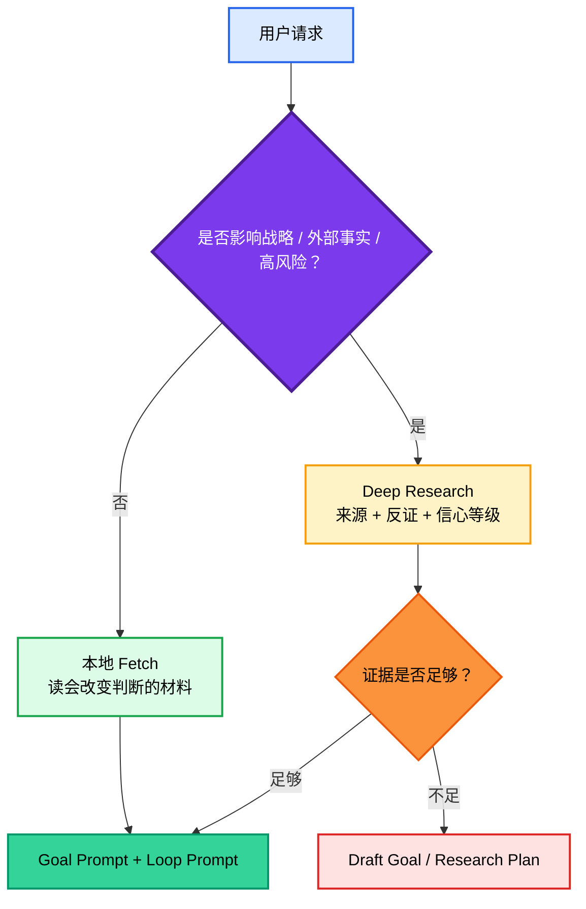
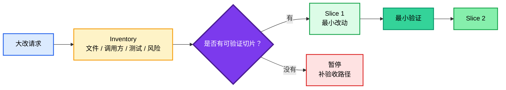

<div align="center">

<h1 style="font-size: 4em; font-weight: 900; margin-bottom: 0.1em; letter-spacing: 0.04em;">GoalPro</h1>
<p style="font-size: 1.1em; color: #2563eb; font-weight: 600; margin-top: 0;">意图放大、Goal Prompt 与 Loop Prompt 协议</p>

<p>
  <strong>简体中文</strong>
</p>

<p>
  
  
  
  
</p>

</div>

## 简介

**GoalPro** 是一个给 Codex 和 Claude Code 共用的 `goalpro` Skill，用来写出高质量 Goal Prompt，并附带交付后继续进化用的 Loop Prompt。

它要解决的问题很直接：用户给 Agent 的任务常常是模糊的、情绪化的、战略标准不清的。模型如果直接执行，很容易过度规划、乱读上下文、先改后想、命令跑通就假装完成。

GoalPro 的作用，是先把请求变成两段交给执行者使用的、可复制、可验证、可暂停的提示词：

- **Goal Prompt**：启动本轮执行，核心是可执行的 **Goal Contract**。
- **Loop Prompt**：在本轮执行结果出来之后使用，引导复盘、差距修复和持续进化；开头先给 `时间参数`，让用户直接填写下一轮什么时候继续，如“手动贴入结果后”或“每天早上 09:00”。

Goal Prompt 要回答：

- 真实意图是什么？
- 完成后局面应该发生什么变化？
- 什么算赢，什么算失败？
- 需要哪些证据、上下文和反证？
- 哪些事情本轮不做？
- 什么情况下必须暂停？
- 最后用什么证明真的完成？
- 完成后给用户看哪个实际样例，方便判断是否通过？

Loop Prompt 要回答：

- 上一轮真实交付了什么？
- 哪些证据证明已经达标，哪些只是表面通过？
- 用户意图还有哪些未满足的差距？
- 本轮应该修复、收敛还是暂停？
- 时间参数怎么填：手动继续、事件触发，还是每天/每周固定时间？
- 这件事是一次性任务，还是值得长期委托的重复 workflow？
- 如果继续，下一轮 LOOP 要继承什么状态？
- 循环预算、无收敛阈值和人工介入条件是什么？
- 什么时候可以停止继续进化？

> 目标不是把提示词写长，也不是替用户执行 goal，而是把 Agent 从“猜用户想要什么”拉回到“按清楚的完成契约执行”。

GoalPro 默认只输出可复制的 Goal Prompt + Loop Prompt，并在输出后停住。两个提示词必须用代码块外的 `Goal Prompt:` / `Loop Prompt:` 标签分开，不额外包一层 prompt rewrite 解释。只有用户另外明确授权执行，后续 Codex / Claude Code / 其他 Agent 才按 Goal Prompt 开始做事；Loop Prompt 只在拿到执行结果后用于持续进化。Loop Prompt 开头必须先给一个可填写的 `时间参数`，但写了时间不等于已经创建后台任务；如果用户要真正定时或后台运行，需要单独设置自动化。

```mermaid
flowchart LR
    subgraph intent["意图层"]
        A["表面请求"] --> B["真实意图"]
        B --> C["战略结果"]
    end

    subgraph contract["契约层"]
        C --> D["成败标准"]
        D --> E["证据标准"]
        E --> F["边界与非目标"]
    end

    subgraph execution["执行层"]
        F --> G["先读上下文"]
        G --> H["分片执行"]
        H --> I["验证与暂停"]
        I --> J["最终报告"]
    end

    subgraph loop["进化层"]
        J --> K["执行结果"]
        K --> L["差距诊断"]
        L --> M["Loop Prompt"]
        M --> N["Next LOOP packet"]
        N --> G
    end

    style intent fill:#dbeafe,stroke:#2563eb,color:#000
    style contract fill:#fef3c7,stroke:#f59e0b,color:#000
    style execution fill:#dcfce7,stroke:#16a34a,color:#000
    style loop fill:#fce7f3,stroke:#db2777,color:#000
    style A fill:#93c5fd,stroke:#2563eb,color:#000,stroke-width:2px
    style B fill:#60a5fa,stroke:#2563eb,color:#000,stroke-width:2px
    style C fill:#34d399,stroke:#059669,color:#000,stroke-width:2px
    style D fill:#fbbf24,stroke:#d97706,color:#000,stroke-width:2px
    style E fill:#a78bfa,stroke:#7c3aed,color:#fff,stroke-width:2px
    style F fill:#fb923c,stroke:#ea580c,color:#000,stroke-width:2px
    style G fill:#2dd4bf,stroke:#0d9488,color:#000,stroke-width:2px
    style H fill:#86efac,stroke:#16a34a,color:#000,stroke-width:2px
    style I fill:#f87171,stroke:#dc2626,color:#fff,stroke-width:2px
    style J fill:#818cf8,stroke:#6366f1,color:#fff,stroke-width:2px
    style K fill:#fbcfe8,stroke:#db2777,color:#000,stroke-width:2px
    style L fill:#f9a8d4,stroke:#be185d,color:#000,stroke-width:2px
    style M fill:#ec4899,stroke:#be185d,color:#fff,stroke-width:2px
    style N fill:#be185d,stroke:#831843,color:#fff,stroke-width:2px
```



### 一句话总结

> 先放大真实意图，再锁定战略标准，然后写成 Agent 能执行、用户能验收、结果能继续进化的双提示词。

## GoalPro 是什么、不是什么

| 概念 | 它是什么 | 它不是什么 |
|---|---|---|
| **GoalPro Skill** | 写出 Goal Prompt + Loop Prompt 的 Skill | 执行 goal 的工具，也不是简单的提示词润色器 |
| **Goal Prompt** | 给执行者启动本轮任务的可执行提示词，核心是 Goal Contract | 一串漂亮但无法验收的愿景 |
| **Loop Prompt** | 给执行结果之后使用的持续循环协议，开头给 `时间参数`，每轮产出 `Next LOOP packet` | 当前回合的自动执行授权、一次性返工提示词、后台调度器本身，或无限循环的借口 |
| **Goal Contract** | Goal Prompt 里的可执行、可验证、可暂停目标说明 | 空泛愿景或待办清单 |
| **Workflow lens** | 生成 Goal Prompt / Loop Prompt 时使用的判断层：识别重复工作，并把必要的 Trigger / Checkpoint / Brief 写进这两段提示词 | 第三个输出、Workflow Prompt、执行器、流程图交付物，或后台自动化 |
| **Deep Research 门槛** | 战略和外部事实任务的证据前置要求 | 为了显得专业而堆链接 |
| **Inventory** | 大改前的影响面、调用方、测试入口盘点 | 先重构再补解释 |
| **表达经济** | 战略完整后的删空话 | 把省字数当核心目标 |

## 好 Goal + Loop 的质量门

输出 Goal Prompt + Loop Prompt 前，先过这七个门：

1. **意图对齐**：不能只复述用户原话，必须说清用户真正要改变的局面；如果多种解释会改变路线、风险或验收，先问或写明默认假设。
2. **字段互证**：`Intent`、`Strategic outcome`、`Decision standard`、`Execution policy`、`Verification` 必须互相支撑，不能各写各的。
3. **可执行**：执行者能看出对象、动作、先读什么、做哪一片、不做什么、何时暂停。
4. **可验收**：验证证据必须对应用户目标，不能用命令通过冒充真实完成；完成后必须展示一个实际样例、案例片段、截图说明或改后输出片段，让用户能判断是否通过。
5. **Workflow lens**：看到每天、每周、自动、持续、发布、运营、监控、队列、复盘等信号时，先判断是不是重复工作；只有重复工作才在 Goal Prompt / Loop Prompt 里补 Trigger、Checkpoint、Brief，不新增第三段输出。
6. **可进化**：Loop Prompt 必须先给 `时间参数`，再要求读取上一轮真实结果和证据，指出剩余差距，给出 Done / Continue / Pause 判断，在 Continue 时输出 `Next LOOP packet`，并用 guardrails 防止无限循环。
7. **不过度**：小任务不强行 deep research、inventory、workflow lens 或 eval；只有会改变判断、防止真实失败时才加流程。

## 快速示例

**你说：**

> 帮我写一个高质量 goal，让 Codex 修这个项目，别再跑偏。

**GoalPro 应该输出两段：**

Goal Prompt:

```markdown
Goal:
修复项目当前阻塞问题，并交付一份能证明行为恢复的变更。

Intent:
用户真正要的不是“看起来改了代码”，而是让 Agent 先搞清失败点、影响面和验收标准，再做最小必要修复。

Strategic outcome:
项目从不可判断/不可运行状态回到可验证状态；后续继续迭代时不会靠聊天记忆猜测完成度。

Decision standard:
用户目标完成度 > 证据质量 > 最小改动 > 表达经济。不能用命令通过冒充用户目标完成。

Evidence standard:
先读错误、点名文件、README/AGENTS/CLAUDE、相关测试命令；修复后区分结构检查、本地验证和人工验收。

Execution policy:
小修直接做；跨模块或重构先输出 inventory、影响面和分片验证计划。

Stop conditions:
需要删除数据、发布、处理密钥、改公共接口，或发现多条互斥路线时暂停确认。
```

Loop Prompt:

```markdown
时间参数:
请自行填写 LOOP 时间，如“每天早上 09:00”；如果只想手动继续，填写“手动：贴入上一轮结果或 Next LOOP packet 后继续”。

Loop mission:
持续推进“项目恢复到可验证状态”这个目标；每轮基于真实执行结果关闭最高价值差距，直到 Done 或 Pause。

Loop state:
保留原始意图、当前轮次、已关闭证据、仍未关闭差距、下一轮焦点和暂停风险；不要每轮重新开始。

Previous result to inspect:
上一轮最终报告、diff、验证输出、失败日志、用户反馈和仍未解决的问题。

Review evidence:
区分已经通过的结构检查、本地验证、人工验收和没有证据支撑的完成声明。

Gap diagnosis:
找出用户原始意图仍未满足的差距，按“阻塞交付 > 影响体验 > 表达/整理”排序。

Cycle action:
本轮只修复仍影响交付级结果的最高价值差距；不要重开已经验证通过的范围。若发现路线错误，先暂停说明原因。

Verification delta:
补跑或新增能证明剩余差距已关闭的最小验证，并说明上一轮证据与本轮证据的差异。

Loop guardrails:
最多连续 3 个 LOOP 周期；若连续 2 轮没有减少开放差距、验证仍不可运行、或需要删除/发布/密钥/架构方向决策，则 Pause 请求用户判断。

Continuation protocol:
每轮结束必须判定 `Done`、`Continue` 或 `Pause`。如果仍有未关闭且值得继续的差距，输出可直接复制到下一轮的 `Next LOOP packet`；如果差距已关闭，报告 Done；如果连续两轮无收敛、验证无法运行或需要用户决策，报告 Pause。

Next LOOP packet:
包含原始目标、当前轮次、已关闭证据、开放差距、时间参数、下一轮焦点、要读取的材料、停止条件和本轮新增验证。下一轮 Agent 可以只拿这个 packet 继续。
```

这类输出的重点不是“格式完整”，而是让执行者知道：先读什么、做什么、不做什么、什么时候进入下一轮、什么时候停、最后拿什么证明。交付后，你可以按 `时间参数` 手动继续；如果要它真的定时或后台自动跑，需要另行授权自动化设置。

## 快速开始

GoalPro 同时支持 Claude Code 和 Codex。下面的命令要在本组件目录 `skills/goalpro/` 中执行；当前目录本身就是唯一发布包，不依赖仓库内的运行时镜像。

### Claude Code 个人级安装

PowerShell：

```powershell
$dest = "$env:USERPROFILE\.claude\skills\goalpro"
New-Item -ItemType Directory -Force $dest | Out-Null
Copy-Item -Force "SKILL.md" $dest
Copy-Item -Recurse -Force "references" $dest
```

Bash：

```bash
mkdir -p ~/.claude/skills/goalpro
cp SKILL.md ~/.claude/skills/goalpro/
cp -R references ~/.claude/skills/goalpro/
```

### Codex 个人级安装

PowerShell：

```powershell
$dest = "$env:USERPROFILE\.codex\skills\goalpro"
New-Item -ItemType Directory -Force $dest | Out-Null
Copy-Item -Force "SKILL.md" $dest
Copy-Item -Recurse -Force "references" $dest
```

Bash：

```bash
mkdir -p ~/.codex/skills/goalpro
cp SKILL.md ~/.codex/skills/goalpro/
cp -R references ~/.codex/skills/goalpro/
```

### 项目级安装

把当前组件中的 `SKILL.md` 和 `references/` 复制到目标项目对应目录：

```text
目标项目/
├── .claude/skills/goalpro/   # Claude Code
└── .codex/skills/goalpro/    # Codex
```

## Skill 名称与触发

Skill 名称是 `goalpro`。

这里不用 `goal`，是为了避免和用户口头说的 goal、Goal Contract 字段，以及 slash command 语义产生混淆。Claude Code 中 Skill 可通过 `/skill-name` 调用，因此本 Skill 的直接入口是 `/goalpro`；`/goal` 不是本项目 Skill 名。

常见触发方式：

- `写一个高质量 goal`
- `帮我优化这个任务提示词`
- `把这个需求变成可执行的 Goal Contract`
- `给 Claude Code 写执行任务`
- `明确 done when / success criteria`
- `先 deep research 再定战略`
- `这个计划跑偏了，重写 goal`
- `大改前先给 inventory 和验证计划`
- `给我一个交付后继续进化用的 LOOP`

## 使用路径

| 任务 | 方法重点 | 输出 |
|---|---|---|
| **模糊需求** | 放大真实意图、定义成败标准 | Goal Prompt + Loop Prompt |
| **战略任务** | Deep Research、证据地图、反证 | Research-backed Goal Prompt + Loop Prompt |
| **执行前 goal** | 先读上下文、分片执行、验证 | Codex `/goal` block 或 Claude Code 任务提示词 + Loop Prompt |
| **大改/重构** | Inventory、影响面、测试入口 | 分片计划和暂停条件 |
| **修复跑偏** | 找旧目标错位点、重写边界 | 修正版 Goal Prompt + Loop Prompt |
| **重复工作/自动化** | 判断是否是可委托 workflow，写清 Trigger / Checkpoint / Brief / source of truth | Goal Prompt + Loop Prompt，必要时给自动化设置说明 |
| **交付后进化** | 复盘上一轮结果、定位差距、收敛验证 | Loop Prompt |
| **验收收尾** | 区分结构检查、本地验证、人工验收 | 最终报告标准 |

---

## 联系方式


GitHub <a href="https://github.com/KimYx0207">KimYx0207</a> |
X <a href="https://x.com/KimYx0207">@KimYx0207</a> |
官网 <a href="https://www.aiking.dev/">aiking.dev</a> |
微信公众号：<strong>老金带你玩AI</strong>

飞书知识库：
<a href="https://my.feishu.cn/wiki/OhQ8wqntFihcI1kWVDlcNdpznFf">长期更新入口</a>

### 请老金喝杯咖啡

如果 GoalPro 对你有帮助，欢迎请我喝杯咖啡，算是对持续维护的支持。

<table align="center">
<tr><th>微信支付</th><th>支付宝</th></tr>
<tr>
<td align="center"></td>
<td align="center"></td>
</tr>
</table>

---

## 方法架构

GoalPro 的核心不是固定模板，而是一条把意图写成可执行 Goal Prompt、再给出交付后 Loop Prompt 的主干。它保障提示词质量，不替执行者完成任务。遇到持续、自动、发布、运营、监控、队列、复盘类请求时，先用 workflow lens 判断哪些信息应该写进这两段提示词；workflow lens 自己不成为第三个交付物。

```text
Critical -> Fetch -> Thinking -> Workflow lens -> Inventory -> Contract -> Review -> Verification -> Loop
```

### 主干

| 阶段 | 要解决的问题 | 不通过时的处理 |
|---|---|---|
| **Critical** | 用户真正要改变什么？ | 回到意图，不直接执行表面请求 |
| **Fetch** | 哪些材料会改变判断？ | 先读本地上下文或外部来源 |
| **Thinking** | 哪条路线最能赢？ | 比较取舍，标出反证和未知 |
| **Workflow lens** | 这是一件一次性任务，还是可委托的重复工作？ | 重复工作才把 Trigger、Checkpoint、Brief 写进 Goal Prompt / Loop Prompt；一次性任务不加流程包袱 |
| **Inventory** | 执行者需要先知道哪些影响面和验证入口？ | 大改前把盘点要求写进 goal |
| **Contract** | 如何写成执行者能照着做的契约？ | 补齐目标、边界、暂停条件 |
| **Review** | 有没有空话、越界、假完成？ | 删掉装饰性流程，保留判断 |
| **Verification** | 执行者最后要拿什么证明完成？ | 区分未验证、结构检查、本地验证、人工验收 |
| **Loop** | 执行结果回来后如何继续进化？ | 写清复盘证据、剩余差距、迭代上限和停止条件 |

### Deep Research 门

战略、外部事实、高风险任务不能直接给最终 Goal。



### Evidence Map

战略任务必须形成证据地图，而不是只贴链接：

```markdown
Evidence Map:
- Source:
  Source type:
  Claim:
  Relevance:
  Confidence:
  Counterevidence:
  Decision impact:
```

### Inventory 门

大改、重构、跨模块任务必须先盘点：



## Goal Prompt / Goal Contract 字段

| 字段 | 作用 | 常见错误 |
|---|---|---|
| `Goal` | 一句话说明任务对象、动作和方向 | 写成愿景 |
| `Intent` | 放大后的真实意图 | 复述用户原话 |
| `Strategic outcome` | 完成后局面发生什么变化 | 只写交付物 |
| `Decision standard` | 路线判断、优先级、失败条件 | “高质量”但不可判 |
| `Evidence standard` | 来源、验证、反证、信心等级 | 搜到资料就算完成 |
| `Workflow lens` | 可选；作为 Goal Prompt 内的判断说明，重复工作时写清 Trigger、Checkpoint、Brief 和 source of truth | 给所有任务都塞工作流字段，或输出第三个 Workflow Prompt |
| `Scope` | 本轮包含什么 | 塞未来计划 |
| `Non-goals` | 本轮不做什么 | 写“无”但任务很宽 |
| `Context to read first` | 先读哪些会改变判断的材料 | 全仓库漫游 |
| `Constraints` | 权限、安全、兼容、语言等硬限制 | 写成建议 |
| `Execution policy` | 执行者直接做、先问、先 inventory 的规则 | 仪式化提问 |
| `Checkpoints` | 推进节点和可检查产物 | 过程流水账 |
| `Verification` | 执行者必须交付的完成证据 | 命令通过 = 完成 |
| `Stop conditions` | 必须暂停的条件 | 风险出现还继续 |
| `Final report` | 最后汇报形状；必须包含可判断的验收样例/案例片段 | 大段复述过程，或只说“已完成”不给样例 |

## Loop Prompt 字段

| 字段 | 作用 | 常见错误 |
|---|---|---|
| `Loop mission` | 说明持续进化使命和最终 Done 条件 | 写成一次性返工目标 |
| `Loop state` | 保存原始目标、当前轮次、已关闭证据、开放差距和下一轮焦点 | 每轮重新开始 |
| `时间参数` | 放在 Loop Prompt 最前面，让用户填写下一轮何时继续，如手动、每天 09:00、每次部署后 | 只写 Continue，不给时间入口；把填写时间冒充已创建后台任务 |
| `Trigger / Checkpoint / Brief` | 可选；作为 Loop Prompt 字段，说明重复 workflow 何时触发、何处人工确认、给用户看什么决策摘要 | 把它们当成第三段交付，或把原始草稿、日志、长 diff 直接丢给用户 |
| `Previous result to inspect` | 指定要读取的最终报告、diff、验证、截图、用户反馈等 | 只看聊天结论，不看证据 |
| `Review evidence` | 区分真实通过、结构检查、人工验收、无证据声明 | 把“说已完成”当完成 |
| `Gap diagnosis` | 找出原始意图仍未满足的点并排序 | 无限扩范围、重开已完成事项 |
| `Cycle action` | 规定本轮只处理哪个最高价值差距 | 看到问题就大改 |
| `Verification delta` | 说明本轮比上一轮多证明了什么 | 重复跑无关测试 |
| `Loop guardrails` | 规定最大尝试、时间预算、无收敛阈值、可改范围、暂停调度和人工审查触发 | 持续变成无限自动循环 |
| `Continuation protocol` | 每轮结束判定 Done / Continue / Pause | 只写“建议继续” |
| `Stop / escalate conditions` | 规定什么时候必须停下来问用户或升级判断 | 路线错误、权限风险仍继续 |
| `Next LOOP packet` | 生成下一轮可直接复用的状态包 | 下一轮还靠聊天记忆 |

## 设计原则

| 原则 | 原因 |
|---|---|
| 意图完成度优先 | 任务真正完成，比提示词漂亮更重要 |
| 意图对齐先过门 | 表面请求、真实意图、战略结果、执行策略和验收证据必须互相支撑 |
| 可执行性优先 | goal 必须让执行者知道对象、动作、边界、检查点和停止条件 |
| 证据先于战略 | 没有 Fetch 的战略只能是草案 |
| 上下文按需读取 | 全仓库漫游会制造噪音和误判 |
| 大改先 inventory | 先知道影响面，才能控制重构风险 |
| 社区信号要交叉验证 | GitHub、X、Reddit 能暴露失败模式，但不能替代证据 |
| 表达经济从属 | 只删空话，不删判断、边界、证据和验收 |
| 验证分层 | 结构检查、本地验证、线上验证、人工验收不是一回事 |
| 完成后给样例 | 改完必须给用户看实际样例/案例片段，否则用户无法判断是否通过 |
| Prompt-only 边界 | GoalPro 产出 goal 后停止，执行需要用户另行授权 |
| 输出永远是两段提示词 | 默认只交付 `Goal Prompt` 和 `Loop Prompt`；workflow lens、inventory、deep research 都只是生成这两段提示词的判断规则 |
| Loop 不是执行授权 | Loop Prompt 只供交付后粘贴使用，不能让 GoalPro 当前回合继续执行 |
| Loop 有时间入口 | 开头先给 `时间参数`；定时/后台执行属于自动化设置，需要显式授权 |
| Loop 必须可持续且可停止 | 每轮结束要输出 `Next LOOP packet` 或明确 Done / Pause，同时保留 guardrails，不能只修一轮也不能无限循环 |
| Workflow 按需启用 | 先判断是否是重复工作；是才把 Trigger、Checkpoint、Brief 写进 Goal / Loop，不是就别加 |
| 少问但问准 | 只问会改变路线的阻塞问题，并给推荐答案；能读上下文解决的问题先读 |
| 进化依赖证据 | 下一轮必须读取上一轮真实结果、验证、用户反馈和 LOOP state，而不是凭感觉重写 |
| 不增加装饰机制 | agent、hook、eval 只有能防真实失败时才加 |

---

## 文件结构

```text
SKILL.md                          # Claude Code / Codex 共用入口
references/
├── examples.md
└── source-rules.md
README.md                         # 中文项目页
docs/images/                      # 联系二维码和收款码
```

不提交的本机产物：

- `.codex/`
- `.meta-kim/`
- `graphify-out/`
- Python / Node 缓存、虚拟环境、构建输出、`.env`

---

## 参与贡献

如果你发现 Goal Prompt / Loop Prompt 字段不够清楚、示例不够贴近真实任务，或者某条规则会导致 Agent 过度规划，可以开 Issue 或提交 PR。

贡献时请保持三条边界：

1. 不把缩短提示词当核心目标。
2. 不为了完整感增加机制。
3. 不把未经验证的社区观点写成标准。

---

## 延伸阅读

- [GoalPro Skill](SKILL.md)
- [方法依据](references/source-rules.md)
- [示例校准](references/examples.md)
