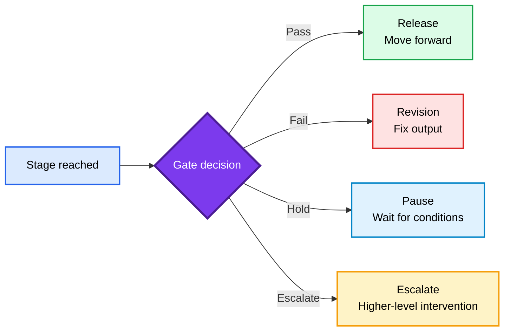
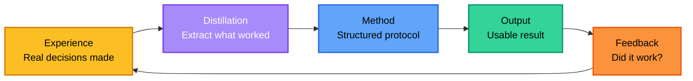

<div align="center">

<h1 style="font-size: 4em; font-weight: 900; margin-bottom: 0.1em; letter-spacing: 0.05em;">KIM</h1>
<p style="font-size: 1.1em; color: #7c3aed; font-weight: 600; margin-top: 0;">DECISION & DELIVERY PROTOCOL</p>

<p>
  <a href="README.md">English</a> |
  <a href="README.zh-CN.md">简体中文</a>
</p>

<p>
  
  
  
  
</p>

</div>

## Overview

**KIM Skill** is a decision protocol for turning fuzzy questions into usable next actions.

It is built for the moments where a normal prompt usually produces confident but vague advice: should I launch, sell, price, cut scope, change direction, or run a test first? KIM forces the agent to state the intent, map the path, label the evidence, define the smallest useful test, and end with something you can execute.

Most AI skills tell the model *what style to use*. KIM asks a different question: **does the agent actually have a method for reaching a usable result — or is it just improvising with confidence?**

> The point is simple: less inspirational advice, more decisions that can be tested.

## Project info

| Item | Value |
|------|-------|
| GitHub repository | [KimYx0207/Kim_Decision](https://github.com/KimYx0207/Kim_Decision) |
| Local development path | This component directory in the cloned repository |
| Runtime targets | Claude Code and Codex |
| Claude Code package | Install this component into `.claude/skills/kim-decision/` |
| Codex package | Install this component into `.codex/skills/kim-decision/` |
| Skill name | `kim-decision` |
| Common trigger words | `KIM`, `Kim`, `laojin`, `老金`, `问问老金` |
| License | MIT OR Apache-2.0 |
| Changelog | [CHANGELOG.md](CHANGELOG.md) |

This component directory is the public package for the KIM decision protocol. `SKILL.md` and `references/` are the runtime core; `docs/zh-CN/` contains the Chinese reference materials.

Without a method, the model improvises. With KIM, every output follows one spine:

```mermaid
flowchart LR
    subgraph define["Define"]
        I["Intent<br/>What must change"] --> S["Subject<br/>Who experiences it"]
        S --> P["Path<br/>How they get there"]
    end

    subgraph verify["Verify"]
        C["Constraint<br/>Hard limits"]
        E["Evidence<br/>Confirmed or not"]
        MT["Minimum Test<br/>Smallest decider"]
        P --> C --> E --> MT
    end

    subgraph deliver["Deliver"]
        M["Models<br/>Abstract tools"]
        G["Gates<br/>Pass or fail"]
        O["Output<br/>Usable result"]
        MT --> M --> G --> O
    end

    style define fill:#fef3c7,stroke:#f59e0b,color:#000
    style verify fill:#dbeafe,stroke:#2563eb,color:#000
    style deliver fill:#dcfce7,stroke:#16a34a,color:#000

    style I fill:#fbbf24,stroke:#d97706,color:#000,stroke-width:2px
    style S fill:#60a5fa,stroke:#2563eb,color:#000,stroke-width:2px
    style P fill:#34d399,stroke:#059669,color:#000,stroke-width:2px
    style C fill:#fb923c,stroke:#ea580c,color:#000,stroke-width:2px
    style E fill:#a78bfa,stroke:#7c3aed,color:#fff,stroke-width:2px
    style MT fill:#2dd4bf,stroke:#0d9488,color:#000,stroke-width:2px
    style M fill:#f87171,stroke:#dc2626,color:#fff,stroke-width:2px
    style G fill:#818cf8,stroke:#6366f1,color:#fff,stroke-width:2px
    style O fill:#fbbf24,stroke:#d97706,color:#000,stroke-width:2px
```



The operating layer stays abstract — no hardcoded personas. The delivery layer allows concrete evidence when real names, cases, data, or file paths improve trust.

### One-line summary

> Define intent, map the path, verify evidence, run the minimum test, pass the gates, deliver the usable result.

This is not a new concept. Mature decision teams already do this. KIM turns it into a runnable protocol for AI, instead of relying on human discipline alone.

### What KIM is and is not

| Concept | What it is | What it is not |
|---------|-----------|---------------|
| **KIM** | A decision and delivery protocol | A persona prompt or character template |
| **Abstract method** | Transferable across any task | Locked to one voice or style |
| **Concrete evidence** | Verified facts that build trust | Invented claims dressed as knowledge |
| **Gates** | Pass/fail checkpoints between stages | The stages themselves |
| **Minimum test** | The smallest experiment that changes the decision | A small task or a trivial check |

### Quick example

**You ask:**

> I want to use AI to make extra money this month. Should I sell AI poster packages to local restaurants?

**KIM outputs (business format):**

```
**Proceed, but do not sell a generic "AI design service".**

Sell a "weekly restaurant promo poster package": 4 posters, delivered in 24 hours, starting at ¥299. The owner is not buying AI; they are buying promotion material for today's menu, delivery app, WeChat group, and storefront.

The owner should see a poster that says "Lunch set ¥29.9, valid 11:00-14:00" and immediately know where to use it.

<br>

## Do first

Today, pick one restaurant category, make 3 sample posters, and pitch 10 nearby owners with the ¥299 package. Take a deposit before custom work, then make 4 posters from the menu.

<br>

## Decision ruler

Pass: 3 paid deposits within 7 days and delivery under 90 minutes per customer.

Kill: 10 direct pitches produce fewer than 2 serious price conversations, or every buyer requires heavy custom edits.

Assumption: restaurant owners will pay for a fixed 24-hour poster package before seeing custom work.

Hard gap: local willingness to pay and actual delivery time are unknown until the first 10 pitches.
```

**You ask:**

> My short-video account gets views but makes no money. What should I sell first?

**KIM outputs (default format):**

```
**Sell the smallest paid shortcut related to the content that already gets comments.**

Do not start with a course, community, or broad consulting offer. The first money is usually hidden in the same question viewers keep repeating.

If viewers keep asking "Can you send the template?", "How do I do this?", or "Can you look at mine?", turn that repeated request into a downloadable shortcut.

<br>

## Do first

Export the last 30 video titles, top 20 comments, and all DMs from the last 14 days. Pick the most repeated urgent problem, then build one ¥19-¥99 template or checklist and sell it through a pinned comment and DM reply.

<br>

## Decision ruler

Pass: 10 paid orders or >=3% purchase rate from link clicks within 7 days.

Kill: high clicks but zero purchases, or buyers cannot use the template without personal help.

Assumption: repeated viewer questions indicate enough urgency to buy a low-price shortcut.

Hard gap: niche, audience size, comment quality, and DM history have not been inspected.
```

Every answer must be specific enough to act on immediately. If it is not, the answer is a list of questions to resolve first.

KIM's visible answer should read in a natural format by default: judgment first, action next, standards last. It should expose the test assumption being checked and name hard gaps separately from ordinary risks.

## Quick Start

KIM supports both Claude Code and Codex. Run these commands from this component directory (`skills/kim-decision/`); it is the source package and does not depend on an embedded runtime projection.

**Claude Code personal install** (available in every project):

```bash
mkdir -p ~/.claude/skills/kim-decision
cp SKILL.md ~/.claude/skills/kim-decision/
cp -R references examples ~/.claude/skills/kim-decision/
```

**Claude Code project install** (copy into another repo):

```bash
TARGET_REPO=/path/to/project
mkdir -p "$TARGET_REPO/.claude/skills/kim-decision"
cp SKILL.md "$TARGET_REPO/.claude/skills/kim-decision/"
cp -R references examples "$TARGET_REPO/.claude/skills/kim-decision/"
```

**Codex personal install** (available in every project):

```bash
mkdir -p ~/.codex/skills/kim-decision
cp SKILL.md ~/.codex/skills/kim-decision/
cp -R references examples ~/.codex/skills/kim-decision/
```

Enable Codex's native question surface in `~/.codex/config.toml`:

```toml
[features]
default_mode_request_user_input = true
```

**Codex project install** (copy into another repo):

```bash
TARGET_REPO=/path/to/project
mkdir -p "$TARGET_REPO/.codex/skills/kim-decision"
cp SKILL.md "$TARGET_REPO/.codex/skills/kim-decision/"
cp -R references examples "$TARGET_REPO/.codex/skills/kim-decision/"
```

### Trigger words

The skill name is `kim-decision`. It should also be triggered by `KIM`, `Kim`, `laojin`, `老金`, and `问问老金`.

Common Chinese trigger phrases include: `老金怎么看`, `帮我判断`, `重新想`, `仔细看`, `分析一下`, `这个能不能做`, `怎么变现`, `卖什么`, `怎么定价`, and `先做哪个验证`.

Recommended reading order:

1. `SKILL.md` — the full operating protocol
2. `references/method.md` — the frame with examples
3. `references/path.md` — subject movement analysis
4. `references/models.md` — abstract decision models
5. `references/master-lens.md` — backend expert pressure tests without persona output
6. `references/gates.md` — stage passage control

### Usage paths

| Task | Method focus | Output |
|---|---|---|
| **Decision** | Intent, evidence, model check | Decision and next action |
| **Calibration** | Path break, resistance, signal | Fix and pass condition |
| **Creation** | Subject, narrative, evidence | Draft or template |
| **Debugging** | Symptom, evidence, root cause | Verified fix |
| **Strategy** | Constraint, minimum test, gate | Action plan |
| **Monetization** | Revenue, payer, urgency, delivery loop | First paid test |

---

## Contact


GitHub <a href="https://github.com/KimYx0207">KimYx0207</a> |
X <a href="https://x.com/KimYx0207">@KimYx0207</a> |
Website <a href="https://www.aiking.dev/">aiking.dev</a> |
WeChat Official Account: <strong>老金带你玩AI</strong>

Feishu knowledge base:
<a href="https://my.feishu.cn/wiki/OhQ8wqntFihcI1kWVDlcNdpznFf">long-term updates</a>

### Buy me a coffee

If KIM Skill has been useful, support the project with a coffee.

<table align="center">
<tr><th>WeChat Pay</th><th>Alipay</th></tr>
<tr>
<td align="center"></td>
<td align="center"></td>
</tr>
</table>

### Changelog

For release notes and documentation updates, see [CHANGELOG.md](CHANGELOG.md).

### Method basis

KIM Skill's methodological foundation comes from my research on meta-based intent amplification:

- Paper: <https://zenodo.org/records/18957649>
- DOI: `10.5281/zenodo.18957649`

---

## Method Architecture

This is the core design of KIM. If you only read one section, read this one.

### The spine

```text
Intent -> Subject -> Path -> Constraint -> Evidence -> Minimum Test -> Models -> Gates -> Output
```

Every KIM output walks through this spine. The question is never "what style should the agent use" — it is "has the agent actually followed the method."

### Output modes

| Mode | When | Structure |
|------|------|-----------|
| **Default output** | Complex task, multi-step decision | Run the full frame internally; show only the verdict, key insight, chosen plan, usable artifact, and pass/kill condition |
| **Business output** | Monetization, pricing, client delivery, MVP scope | Explain who pays, why now, what V1 delivers, and what visible result appears in week one |
| **Short output** | Single focused question, narrow scope, no commercial dimension | One-line decision, one path break, 1-3 immediate actions, what not to do, pass condition |

The frame is not meant to be exposed as a filled form by default. KIM runs intent, path, evidence, minimum test, and gates internally, then rewrites the result as a working note: judgment first, why this route wins, what to do next, and what proves it worked.

### Core-problem gate

Before expanding the frame, KIM names the real problem internally: the decision, defect, design gap, offer, path, or artifact the user actually needs. Anything that does not improve that core problem, evidence quality, execution clarity, or review quality gets compressed or cut.

KIM can borrow governance discipline from Meta_Kim, but the visible result stays practical: a sharp decision, minimum test, artifact, or next action.

### Path scale

| Path | Use when | Result |
|------|----------|--------|
| **Fast** | One focused question, local/read-only evidence, low risk | Verdict, leverage point, next action, pass condition |
| **Standard** | Product, business, content, or strategy decision with real uncertainty | Problem cut, evidence, judgment, 24-hour action, decision ruler |
| **Regulated** | High-risk, current external facts, legal/financial/security stakes, multi-step execution, or public durable decision | Evidence labels, research attempts, assumptions, pass/kill gates, hard gaps |

The protocol escalates with risk. It does not force a heavy process just because the skill was triggered.

### Gates

A stage reached is not a stage passed.



Gates exist to stop AI from skipping steps. Reaching a stage means you are there; passing the gate means you are allowed to move on.

The gate set now includes a clarification boundary and a research boundary. KIM asks only the smallest blocking question, inspects local evidence before asking when possible, and verifies current or changing external facts such as APIs, documentation, rules, prices, security advisories, market status, or third-party tool behavior before using them as decision basis.

### Closed loop

The method does not end at Output. Every result feeds back into the method itself — this is the distillation loop:



Experience → distill → method → output → feedback → experience. Every cycle sharpens the protocol.

### Core frame fields

| Field | What it does |
|-------|-------------|
| **Intent** | State what must change. A good intent is an outcome, not a topic. |
| **Subject** | State who experiences the result. Can be a user, buyer, reader, team, system, or decision maker. |
| **Path** | Map how the subject moves from current state to target state: Motive → Interpretation → Action → Resistance → Signal → State Change → Continuation |
| **Constraint** | State the hard limits: time, budget, people, tools, rules, data, risk tolerance. |
| **Evidence** | Separate into: Confirmed, User-provided, Inference, Unconfirmed. Verify claims that depend on external rules, systems, or market conditions. |
| **Minimum Test** | Define the smallest test that can change the decision. Must include: Goal, Input, Action, Output, Test assumption, Pass condition, Fail signal, Next step, Do not do. |
| **Models** | Use abstract decision models (Essence, Path, Constraint, Incentive, Friction, Probability, Risk, Feedback, Compounding, Boundary, Narrative, Sharp Core). Pick the smallest set that can improve the answer. |
| **Gates** | Stop skipped steps. A stage reached is not a stage passed. |
| **Output** | Return a usable artifact: decision, path, checklist, template, acceptance criteria, or next action. |

### Design rules

| Rule | Why |
|------|-----|
| Keep the operating method abstract | Concrete personas lock the model into one voice; abstract methods transfer across tasks |
| Use concrete evidence in final answers | Real names, tools, data, and dates improve trust — but only when verified |
| Label all uncertainty | Unconfirmed claims must be tagged; never present inference as fact |
| End with a usable result | Every response must be specific enough to execute without further research |
| Data gap protocol | When key evidence is missing, state what is missing and ask — never guess |
| Information density | Every sentence must carry new information. Cut sentences that restate the obvious |
| Concrete delivery | Prefer exact tools, exact actions, exact thresholds. If you cannot be concrete, the result is a list of questions to answer first |
| Anti-generic filter | Cut advice that would fit any project; each recommendation needs an actor, object, action, signal, or threshold |
| Best path | When the user asks for a plan, choose the strongest route instead of hiding indecision inside a menu |
| Core-problem first | The method must solve the actual decision or artifact, not display its own scaffolding |
| Research boundary | Current external facts and source-backed claims must be searched or explicitly labeled as unverified/local-only |
| Imagination space | Product, content, offer, and strategy work should include one concrete scene or example that helps the user see the result without hype |
| Prompt quality | Prompt artifacts must force judgment, evidence, thresholds, and usable output instead of empty expert-role boilerplate |
| Natural format | Default answers should not look like filled forms; they should read as working notes with judgment, action, and standards |
| Test assumption | Every execution plan should name the assumption being tested, not only the action being taken |
| Hard gaps | Missing information that blocks judgment must be labeled separately from ordinary risk |

---

## Files

```text
SKILL.md                  # Claude Code / Codex operating protocol
references/
│   ├── method.md         # Core frame with examples
│   ├── path.md           # Subject movement analysis
│   ├── models.md         # Abstract decision models
│   ├── execution.md      # Execution plan protocol
│   ├── distillation.md   # Master distillation protocol
│   ├── master-lens.md    # Backend expert pressure tests
│   ├── gates.md          # Stage passage control (11 gates)
│   ├── business.md       # Business decision layer
│   ├── output.md         # Deliverable standards
│   └── verification.md   # Completion checklist
examples/
    ├── decision.md
    ├── calibration.md
    ├── creation.md
    └── debugging.md
```

---

## Contributing

Found a gap or want to improve a reference? Open an Issue first, then submit a PR. Keep the method abstract — do not add persona-specific content.

---

## Further Reading

- [README.zh-CN.md](README.zh-CN.md)
- [SKILL.md](SKILL.md) — the full operating protocol
- [references/method.md](references/method.md) — the frame with examples

---

## License

Dual licensed under:

- MIT License
- Apache License 2.0

Use either license.
