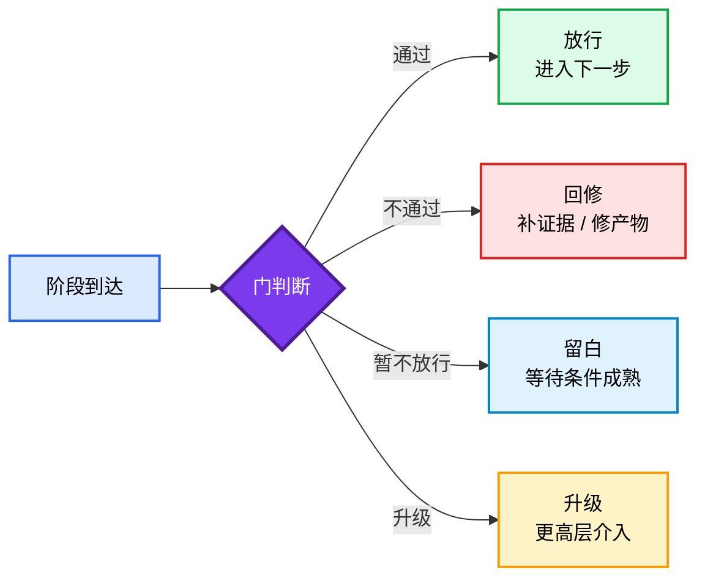

<div align="center">

<h1 style="font-size: 4em; font-weight: 900; margin-bottom: 0.1em; letter-spacing: 0.05em;">老金</h1>
<p style="font-size: 1.1em; color: #7c3aed; font-weight: 600; margin-top: 0;">判断与交付协议</p>

<p>
  <a href="README.md">English</a> |
  <a href="README.zh-CN.md">简体中文</a>
</p>

<p>
  
  
  
  
</p>

</div>

## 简介

**老金 Skill** 是一套把模糊问题变成可执行下一步的判断协议。

它适合处理普通提示词最容易输出空话的场景：要不要上线、卖什么、怎么定价、范围砍到哪里、方向要不要换、先做哪个验证。老金会强制 Agent 说清意图、路径、证据、最小验证和通过标准，最后交付一个能直接执行的结果。

打个比方：大多数 AI skill 告诉模型"用什么风格说话"。老金问的是另一个问题：**Agent 到底有没有一套方法，能把任务推进到可用结果——还是只是在自信满满地胡说八道？**

> 目标很简单：少一点热血建议，多一点能验证、能执行、能交付的判断。

## 项目信息

| 项目 | 内容 |
|------|------|
| GitHub仓库 | [KimYx0207/Kim_Decision](https://github.com/KimYx0207/Kim_Decision) |
| 本地开发目录 | 克隆仓库中的当前组件目录 |
| 运行对象 | Claude Code 和 Codex |
| Claude Code 包 | 将本组件安装到 `.claude/skills/kim-decision/` |
| Codex 包 | 将本组件安装到 `.codex/skills/kim-decision/` |
| Skill名称 | `kim-decision` |
| 常用触发词 | `KIM`、`Kim`、`laojin`、`老金`、`问问老金` |
| 开源协议 | MIT OR Apache-2.0 |
| 更新日志 | [CHANGELOG.md](CHANGELOG.md) |

当前组件目录就是老金判断协议的公开包。`SKILL.md` 和 `references/` 是运行核心；`docs/zh-CN/` 放中文参考资料。

没有方法，模型就是即兴发挥。有了老金，每个输出都沿着一条主干走：

```mermaid
flowchart LR
    subgraph define["定义阶段"]
        I["意图<br/>要改变什么"] --> S["主体<br/>谁经历结果"]
        S --> P["路径<br/>怎么走到目标"]
    end

    subgraph verify["验证阶段"]
        C["约束<br/>硬边界"]
        E["证据<br/>确认还是推断"]
        MT["最小验证<br/>最小有效实验"]
        P --> C --> E --> MT
    end

    subgraph deliver["交付阶段"]
        M["模型<br/>抽象判断工具"]
        G["硬门<br/>通过或不通过"]
        O["输出<br/>可用产物"]
        MT --> M --> G --> O
    end

    style define fill:#fef3c7,stroke:#f59e0b,color:#000
    style verify fill:#dbeafe,stroke:#2563eb,color:#000
    style deliver fill:#dcfce7,stroke:#16a34a,color:#000

    style I fill:#fbbf24,stroke:#d97706,color:#000,stroke-width:2px
    style S fill:#60a5fa,stroke:#2563eb,color:#000,stroke-width:2px
    style P fill:#34d399,stroke:#059669,color:#000,stroke-width:2px
    style C fill:#fb923c,stroke:#ea580c,color:#000,stroke-width:2px
    style E fill:#a78bfa,stroke:#7c3aed,color:#fff,stroke-width:2px
    style MT fill:#2dd4bf,stroke:#0d9488,color:#000,stroke-width:2px
    style M fill:#f87171,stroke:#dc2626,color:#fff,stroke-width:2px
    style G fill:#818cf8,stroke:#6366f1,color:#fff,stroke-width:2px
    style O fill:#fbbf24,stroke:#d97706,color:#000,stroke-width:2px
```



设定层保持抽象——不写死具体角色。答复层允许具体——当真实的姓名、案例、数据或文件路径能增强可信度时可以使用，前提是必须经过验证。

### 一句话总结

> 先定义意图，再建立路径，再查验证据，再做最小验证，通过硬门后交付可用结果。

这不是什么新概念，成熟的决策团队一直在做这件事。只不过老金把它变成了一套 AI 可运行的协议，而不是靠人的自觉。

### 老金是什么、不是什么

| 概念 | 它是什么 | 它不是什么 |
|------|---------|-----------|
| **老金 Skill** | 判断和交付协议 | 角色扮演提示词或人设模板 |
| **抽象方法** | 可跨任务迁移的通用框架 | 锁死在一个声音或风格里 |
| **具体证据** | 经过验证的、能增强可信度的事实 | 编造的、披着知识外衣的声称 |
| **硬门** | 阶段之间的通过/不通过关卡 | 阶段本身 |
| **最小验证** | 能改变判断的最小有效实验 | 一个小任务或走过场的检查 |

### 快速示例

**你问：**

> 我想这个月用 AI 赚点钱，要不要卖本地餐饮店的 AI 海报套餐？

**老金输出（商业格式）：**

```
**可以做，但不要卖“AI 设计服务”。**

卖“本周餐饮促销海报包”：4张图，24小时交付，¥299 起。老板买的不是 AI，是今天菜单、外卖平台、微信群和店门口能马上用的促销物料。

老板第一眼应该看到一张写着“今天午餐套餐 ¥29.9，11:00-14:00 有效”的店门图。他能立刻想象这张图贴到群里、外卖平台和门口立牌上。

<br>

## 先做

今天选一个餐饮品类，先做3张样张，然后直接找10个附近老板推 ¥299 套餐。第一单先收订金，再按菜单做4张图。

<br>

## 判断尺

通过：7天内拿到3笔订金，且每单交付低于90分钟。

停止：10家直推后少于2个老板认真谈价格，或每单都变成大量定制修改。

假设：餐饮老板愿意在看到定制成品前，为固定的 24 小时海报套餐付费。

缺口：本地付费意愿和真实交付耗时，必须等前 10 次直推后才知道。
```

**你问：**

> 我的短视频账号有播放量但不赚钱，第一步应该卖什么？

**老金输出（默认自然格式）：**

```
**先卖高频评论问题直接相关的“小捷径”。**

不要一上来卖课、社群或泛咨询。第一笔钱通常藏在评论区反复出现的同一句话里。

如果观众一直问“模板能发我吗？”“这个怎么做？”“能不能帮我看一下？”，不要继续解释内容，直接把答案变成一个能下载、能照着做的小产物。

<br>

## 先做

导出最近30条视频、前20条高频评论和最近14天私信，找重复最多且最急的一个问题。把答案做成一个 ¥19-¥99 的模板或清单，用置顶评论和私信回复销售。

<br>

## 判断尺

通过：7天内10笔订单，或链接点击后的购买率 >=3%。

停止：点击高但零购买，或买家不用一对一帮助就无法使用模板。

假设：反复出现的观众问题，代表足够强的付费急迫性。

缺口：赛道、粉丝量、评论质量和私信历史还没有被检查。
```

每个回答都必须具体到可以直接执行。如果做不到，回答就是一串待解决的问题清单。

老金默认使用自然格式：先判断，再给动作，最后给标准。执行计划必须写出正在验证的测试假设，并把硬缺口和普通风险分开。

## 快速开始

KIM 同时支持 Claude Code 和 Codex。以下命令请在本组件目录 `skills/kim-decision/` 中执行；当前目录就是源包，不依赖仓库内嵌的运行时镜像。

**Claude Code 个人级安装**（所有项目可用）：

```bash
mkdir -p ~/.claude/skills/kim-decision
cp SKILL.md ~/.claude/skills/kim-decision/
cp -R references examples ~/.claude/skills/kim-decision/
```

**Claude Code 项目级安装**（复制到另一个仓库）：

```bash
TARGET_REPO=/path/to/project
mkdir -p "$TARGET_REPO/.claude/skills/kim-decision"
cp SKILL.md "$TARGET_REPO/.claude/skills/kim-decision/"
cp -R references examples "$TARGET_REPO/.claude/skills/kim-decision/"
```

**Codex 个人级安装**（所有项目可用）：

```bash
mkdir -p ~/.codex/skills/kim-decision
cp SKILL.md ~/.codex/skills/kim-decision/
cp -R references examples ~/.codex/skills/kim-decision/
```

在 `~/.codex/config.toml` 中启用 Codex 原生提问界面：

```toml
[features]
default_mode_request_user_input = true
```

**Codex 项目级安装**（复制到另一个仓库）：

```bash
TARGET_REPO=/path/to/project
mkdir -p "$TARGET_REPO/.codex/skills/kim-decision"
cp SKILL.md "$TARGET_REPO/.codex/skills/kim-decision/"
cp -R references examples "$TARGET_REPO/.codex/skills/kim-decision/"
```

### 触发词

Skill 名称是 `kim-decision`。也应该通过 `KIM`、`Kim`、`laojin`、`老金`、`问问老金` 触发。

常见中文触发句包括：`老金怎么看`、`帮我判断`、`重新想`、`仔细看`、`分析一下`、`这个能不能做`、`怎么变现`、`卖什么`、`怎么定价`、`先做哪个验证`。

建议阅读顺序：

1. `SKILL.md` — 完整操作协议
2. `references/method.md` — 核心框架及示例
3. `references/path.md` — 主体运动分析
4. `references/models.md` — 抽象判断模型
5. `references/master-lens.md` — 不做人物扮演的后台高手压力测试
6. `references/gates.md` — 阶段通过控制

### 使用路径

| 任务 | 方法重点 | 输出 |
|---|---|---|
| **决策** | 意图、证据、模型校验 | 结论和下一步 |
| **校准** | 路径断点、阻力、信号 | 修改方案和通过标准 |
| **创作** | 主体、叙事、证据 | 草稿或模板 |
| **排错** | 现象、证据、根因 | 已验证的修复路径 |
| **策略** | 约束、最小验证、硬门 | 行动方案 |
| **变现** | 收入、付款人、急迫性、交付闭环 | 第一笔付费验证 |

---

## 联系方式


GitHub <a href="https://github.com/KimYx0207">KimYx0207</a> |
X <a href="https://x.com/KimYx0207">@KimYx0207</a> |
官网 <a href="https://www.aiking.dev/">aiking.dev</a> |
微信公众号：<strong>老金带你玩AI</strong>

飞书知识库：
<a href="https://my.feishu.cn/wiki/OhQ8wqntFihcI1kWVDlcNdpznFf">长期更新入口</a>

### 请老金喝杯咖啡

如果老金 Skill 对你有帮助，欢迎请我喝杯咖啡，算是对持续维护的支持。

<table align="center">
<tr><th>微信支付</th><th>支付宝</th></tr>
<tr>
<td align="center"></td>
<td align="center"></td>
</tr>
</table>

### 更新日志

版本变化和文档调整记录在 [CHANGELOG.md](CHANGELOG.md)。

### 方法依据

老金 Skill 的方法论基础来自我（KimYx0207）撰写的"基于元的意图放大"研究：

- 论文：<https://zenodo.org/records/18957649>
- DOI：`10.5281/zenodo.18957649`

---

## 方法架构

这是老金 Skill 最核心的设计。整篇文档最重要的就是这一节。

### 主干

```text
意图 -> 主体 -> 路径 -> 约束 -> 证据 -> 最小验证 -> 模型 -> 硬门 -> 输出
```

每个老金输出都沿着这条主干走。问题从来不是"Agent 应该用什么风格"，而是"Agent 有没有真正遵循方法"。

### 输出模式

| 模式 | 触发条件 | 结构 |
|------|---------|------|
| **默认输出** | 复杂任务、多步决策 | 后台跑完整框架；前台只露出结论、关键洞察、选定方案、可用产物和通过/停止标准 |
| **商业输出** | 变现、定价、客户交付、MVP 范围 | 像谈生意一样说明谁付钱、为什么现在付、第一版交什么、第一周看到什么效果 |
| **简短输出** | 单一聚焦问题、范围窄、无商业维度 | 一句话判断、一个路径断点、1-3个立即动作、不要做什么、通过标准 |

框架不是要原样展示给用户的表格。默认情况下，老金先在后台完成意图、路径、证据、最小验证和硬门检查，再把结果改写成工作便签：先说判断，再说明为什么这条路赢，然后给能马上执行的动作。

### 核心问题门

展开框架前，老金先在后台钉住真正的问题：用户到底需要哪个决策、缺陷判断、设计缺口、offer、路径或交付物。凡是不能提升这个核心问题、证据质量、执行清晰度或复盘质量的内容，都压缩或删除。

老金可以借鉴 Meta_Kim 的治理纪律，但可见结果必须仍然是可用的判断、最小验证、交付物或下一步行动。

### 路径分级

| 路径 | 适用场景 | 结果 |
|------|----------|------|
| **快路径** | 单点问题、本地/只读证据、低风险 | 结论、杠杆点、下一步、通过标准 |
| **标准路径** | 产品、商业、内容、策略类决策，有真实不确定性 | 问题切口、取证、判断、24 小时动作、复盘尺 |
| **监管路径** | 高风险、当前外部事实、法律/金融/安全、多步执行、公开长期决策 | 证据等级、研究尝试、假设、通过/停止门、硬缺口 |

协议随风险升级，不会因为 skill 被触发就默认走重流程。

### 硬门

阶段到了，不代表能过门。



硬门存在的意义就是阻止 AI 跳步骤。到达一个阶段说明你到了；通过硬门才说明你配往前走。

硬门现在包含澄清边界和研究边界。老金只问最小阻塞问题；本地能查时先查再问；版本、API、文档、规则、价格、安全公告、市场状态、第三方工具行为等会变化的外部事实，必须先验证或明确标为未验证/仅本地判断。

### 闭环

方法不会在输出结束。每个结果都会反哺方法本身——这就是蒸馏循环：


经验 → 蒸馏 → 方法 → 输出 → 反馈 → 经验。每一轮都让协议更锋利。

### 核心框架字段

| 字段 | 作用 |
|------|------|
| **意图** | 明确要改变什么。好的意图是结果，不是主题。 |
| **主体** | 经历结果的人。可以是用户、买家、读者、团队、系统、决策者。 |
| **路径** | 映射主体从当前状态到目标状态的过程：动机 → 理解 → 行动 → 阻力 → 信号 → 状态变化 → 延续 |
| **约束** | 明确硬边界：时间、预算、人力、工具、规则、数据、风险承受能力。 |
| **证据** | 分为四类：已确认、用户给定、推断、未确认。依赖外部规则、系统或市场状态的内容必须验证。 |
| **最小验证** | 定义能改变判断的最小实验。必须包含：目标、输入、动作、输出、测试假设、通过标准、失败信号、下一步、不做什么。 |
| **模型** | 使用抽象判断模型（本质、路径、约束、激励、摩擦、概率、风险、反馈、复利、边界、叙事、锋利内核），选最小的有效集合。 |
| **硬门** | 阻止跳步骤。阶段到达 ≠ 阶段通过。 |
| **输出** | 交付一个可用产物：决策、路径、检查清单、模板、验收标准、或下一步行动。 |

### 设计原则

| 原则 | 原因 |
|------|------|
| 操作方法保持抽象 | 具体角色会把模型锁死在一个声音里；抽象方法能跨任务迁移 |
| 答复中使用具体证据 | 真实的姓名、工具、数据、日期能增强可信度——但必须经过验证 |
| 标注所有不确定性 | 未确认的声称必须标记；永远不要把推断当作事实呈现 |
| 以可用结果收尾 | 每个回答都必须具体到可以直接执行，不需要再研究 |
| 数据缺口协议 | 当关键证据缺失时，说明缺什么、问用户要——永远不要猜 |
| 信息密度 | 每句话都必须承载新信息。删掉重复已知内容的句子 |
| 具体交付 | 优先给出精确的工具、精确的动作、精确的阈值。如果无法具体，结果就是一串待回答的问题 |
| 反泛化 | 删掉放到任何项目都成立的话；每个建议必须有执行者、对象、动作、信号或阈值 |
| 最强路径 | 用户要方案时，默认选一条最有效路径，不用一串选项掩盖判断不足 |
| 核心问题优先 | 方法必须解决真正的决策或交付物，不能展示自己的脚手架 |
| 研究边界 | 当前外部事实和需要来源支撑的判断，必须搜索验证或明确标注为未验证/仅本地 |
| 想象空间 | 产品、内容、offer、策略类任务要给一个具体画面或例子，让用户看见结果，但不能煽情 |
| 提示词质量 | 提示词必须逼出判断、证据、阈值和可用产物，避免“你是专家”式空角色 |
| 自然格式 | 默认回答不要像填表；要像工作便签：判断、动作、标准依次推进 |
| 测试假设 | 每个执行计划必须说清这轮动作正在验证什么，不只写动作本身 |
| 硬缺口 | 会阻止判断的信息缺失必须单独标注，不能混进普通风险 |

---

## 文件结构

```text
SKILL.md                  # Claude Code / Codex 完整操作协议
references/
│   ├── method.md         # 核心框架及示例
│   ├── path.md           # 主体运动分析
│   ├── models.md         # 抽象判断模型
│   ├── execution.md      # 执行计划协议
│   ├── distillation.md   # 大师蒸馏协议
│   ├── master-lens.md    # 后台高手压力测试
│   ├── gates.md          # 阶段通过控制（11个门）
│   ├── business.md       # 商业决策层
│   ├── output.md         # 交付标准
│   └── verification.md   # 完成度检查清单
examples/
    ├── decision.md
    ├── calibration.md
    ├── creation.md
    └── debugging.md
```

---

## 参与贡献

发现了方法论的缺口或想改进某个参考文档？先开 Issue，再提 PR。保持方法的抽象性——不要添加特定角色内容。

---

## 延伸阅读

- [README.md](README.md)
- [SKILL.md](SKILL.md) — 完整操作协议
- [references/method.md](references/method.md) — 核心框架及示例

---

## 协议

双协议：

- MIT License
- Apache License 2.0

任选其一使用。
